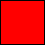

= Scala & Akka Presentation
Lyall Jonathan Di Trapani <jonathan.ditrapani@manheim.com>
v1.0, 2016-08-24
:data-uri:
:stylesheet: style.css
:source-highlighter: pygments

////
Draw actor diagram (3 actors, mailboxes)
Draw box & pointer diagram for list
Draw a stream graph with load balancer & multi parallel streams
Draw our planned stream design?
////

<<<

== Scala Overview Intro

https://github.com/lj-ditrapani/scala-overview

<<<

== Algebraic Data Types

Common in functional programming languages

* product types (AND &)
* sum types (OR |)

<<<

== Product types

* Possible values of a product type is the Cartesian product of the values of
  its component types
* Color: {Red, Blue}  AND  Size: {Small, Medium, Large}

<<<

== Product types

[cols="4*^.^"]
|===

|       | Small | Medium | Large

| Red   | image:red-small.png[] | image:red-med.png[] | image:red-large.png[]

| Blue   | image:blue-small.png[] |  | image:blue-large.png[]
|===

[source,scala]
----
case class Person(name: String, age: Int)
----

<<<

== Sum types

* Possible values of a sum type is the sum of the possible values of all its sub types.

[cols="5*^.^"]
|===
2+| Color
3+| Size

|    | image:blue.png[]
| image:small.png[] |  | image:large.png[]

|===

[source,scala]
----
sealed trait Either[A, B]
case class Left[A, B](value: A) extends Either[A, B]
case class Right[A, B](value: B) extends Either[A, B]
----

<<<

== Scala Overview

List data structure

https://github.com/lj-ditrapani/scala-overview

<<<

== Akka

* Akka actors
* Akka streams
* Akka http
* See akka-streams doc for talking notes
* Show
** http://doc.akka.io/docs/akka/2.4.9/scala/stream/stream-composition.html

<<<

== Resources

* https://en.wikipedia.org/wiki/Algebraic_data_type
* http://merrigrove.blogspot.com/2011/12/another-introduction-to-algebraic-data.html
* http://tpolecat.github.io/presentations/algebraic_types.html#1
* https://gleichmann.wordpress.com/2011/01/30/functional-scala-algebraic-datatypes-enumerated-types/
* http://danielwestheide.com/blog/2012/11/21/the-neophytes-guide-to-scala-part-1-extractors.html

<<<

== Questions?

image::test.jpg[]
