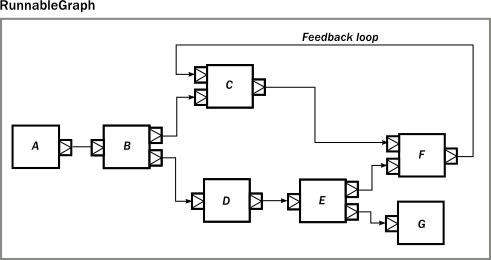

= Scala & Akka Presentation
Lyall Jonathan Di_Trapani <jonathan.ditrapani@manheim.com>
v1.0, 2016-08-24
:data-uri:
:stylesheet: style.css
:source-highlighter: pygments

<<<

== Overview

* Why scala
* Scala language features
* Akka framework

<<<

== Static vs Dynamic Type System

image::scale.png[scale,500,500,align="center"]

<<<

== Functional Programming

[cols="3*^.^a"]
|===
|image:lambda.jpg[]
|image:function.jpg[]
|image:haskell.png[haskell,300,300]
|===

<<<

== Scala Language Features

* Case classes
* Pattern matching
* Type parameters

<<<

== Algebraic Data Types

* product types (AND &)
* sum types (OR |)

<<<

== Product types

* The set of possible values of a product type is the Cartesian product of
  the values of its component types
* Color: {Red, Blue}  AND  Size: {Small, Medium, Large}

<<<

== Product types

[cols="4*^.^"]
|===

|       | Small | Medium | Large

| Red   | image:red-small.png[] | image:red-med.png[] | image:red-large.png[]

| Blue   | image:blue-small.png[] | image:blue-med.png[] | 
|===

[source,scala]
----
case class Person(name: String, age: Int)
----

<<<

== Sum types

* The set of possible values of a sum type is the sum of the possible values
  of all its sub types.

[cols="5*^.^"]
|===
2+| Color
3+| Size

| image:red.png[]   | image:blue.png[]
| image:small.png[] | image:med.png[] | 
|===

[source,scala,linenums]
----
sealed trait Either[A, B]
case class Left[A, B](value: A) extends Either[A, B]
case class Right[A, B](value: B) extends Either[A, B]
----

<<<

== List Data Structure

List is a Cons or a Nil

* Cons(value, List)
* Nil terminates a list

[cols="2*.^"]
|===
|   | `Cons(5, Nil)`

| image:list2.png[list2,220,50]  | `Cons(5, Cons(22, Nil))`
|===

<<<

== List Data Structure

List is a Cell or a Empty

* Cell(value, List)
* Empty terminates a list

[cols="2*.^"]
|===
|   | `Cell(5, Empty)`

| image:list2.png[list2,220,50]  | `Cell(5, Cell(22, Empty))`
|===

<<<

== List ADT in Scala

[source,scala,linenums]
----
sealed trait Lst
case class Cell(head: Int, tail: Lst) extends Lst
case class Empty() extends Lst
----

<<<

== Case classes

* Product types
* Immutable value objects
* Free methods:
** apply
** unapply
** toString
** copy
** == & hash

<<<

== Pattern Matching

[source,scala,linenums]
----
sealed trait Lst {
  @tailrec
  def reduce(zero: Int)(f: (Int, Int) => Int): Int =
    this match {
      case x: Empty => zero
      case x: Cell => x.tail.reduce(f(zero, x.head))(f)
    }
}
----

<<<

== Pattern Matching with Case Classes

[source,scala,linenums]
----
sealed trait Lst {
  @tailrec
  def reduce(zero: Int)(f: (Int, Int) => Int): Int =
    this match {
      case Empty() => zero
      case Cell(h, t) => t.reduce(f(zero, h))(f)
    }
}
----

<<<

== Type Parameterized Method

[source,scala,linenums]
----
sealed trait Lst {
  @tailrec
  def reduce[B](zero: B)(f: (B, Int) => B): B =
    this match {
      case Empty() => zero
      case Cell(h, t) => t.reduce(f(zero, h))(f)
    }
}
----

<<<

== Type Parameterized Class

[source,scala,linenums]
----
sealed trait Lst[A] {
  @tailrec
  def reduce[B](zero: B)(f: (B, A) => B): B =
    this match {
      case Empty() => zero
      case Cell(h, t) => t.reduce(f(zero, h))(f)
    }
}

case class Cell[A](head: A, tail: Lst[A]) extends Lst[A]

case class Empty[A]() extends Lst[A]
----

<<<

== Empty object

[source,scala,linenums]
----
sealed trait Lst[+A] {
  @tailrec
  def reduce[B](zero: B)(f: (B, A) => B): B =
    this match {
      case Empty => zero
      case Cell(h, t) => t.reduce(f(zero, h))(f)
    }
}

case class Cell[A](head: A, tail: Lst[A]) extends Lst[A]

object Empty extends Lst[Nothing]
----

<<<

== Expression Problem

Example from: http://c2.com/cgi/wiki?ExpressionProblem

Functional Programming

[source,haskell,linunums]
----
type Shape = Square of side
           | Circle of radius

define area = fun x -> case x of
    Square of side => (side * side)
  | Circle of radius => (3.14 *  radius * radius)
----

<<<

== Expression Problem

Object Oriented Programming

[source,cpp,linenums]
----
class Shape <: Object
  virtual fun area : () -> double

class Square <: Shape
  side : double
  area() =  side * side

class Circle <: Shape
  radius : double
  area() = 3.14 * radius * radius
----

<<<

== Scala Overview

For more detail:

https://github.com/lj-ditrapani/scala-overview

<<<

== Akka

* Threads
* Akka actors
* Akka streams
* Akka http

<<<

== Threads

<<<

== Actors

image::actors.png[align="center"]

<<<

== Streams

image::streams1.png[streams1,400,400,align="center"]

<<<

== Streams

image::streams2.png[streams2,500,500,align="center"]

<<<

== Streams

image::streams3.png[align="center"]

<<<

== Resources

* https://en.wikipedia.org/wiki/Algebraic_data_type
* http://c2.com/cgi/wiki?ExpressionProblem
* http://doc.akka.io/docs/akka/2.4.9/scala/stream/stream-composition.html
* http://akka.io/docs

<<<

== Questions?

image::test.jpg[cat,400,400,align="center"]
